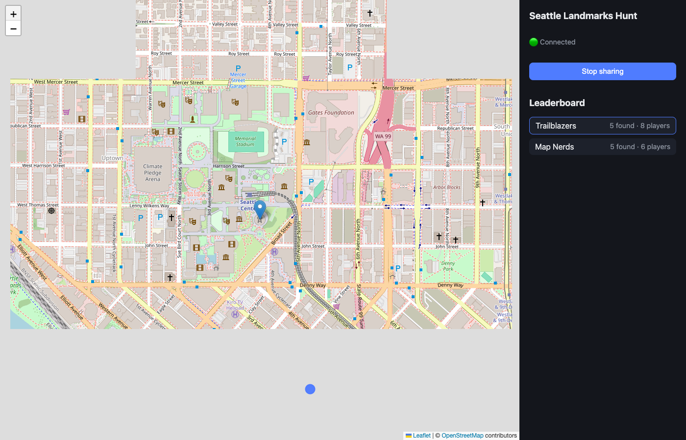
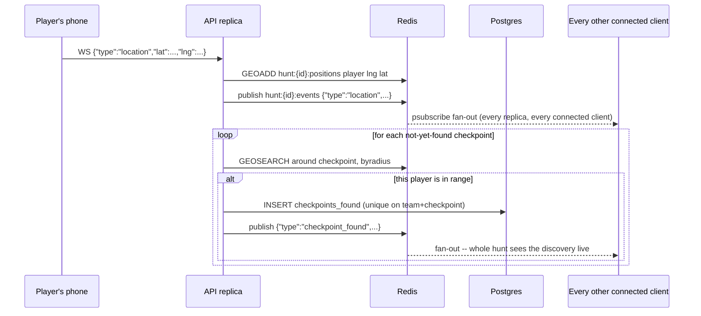
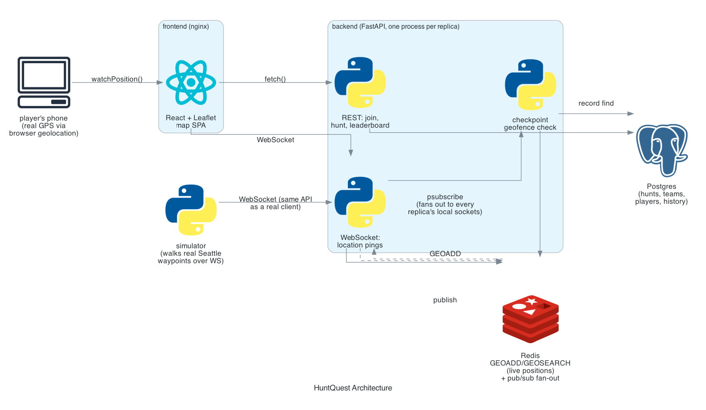

# HuntQuest

[](https://github.com/kartik117/huntquest/actions/workflows/ci.yml)

A real-time, map-based scavenger hunt. Teams walk to real Seattle landmarks; everyone on the hunt sees every team's live position on a shared map, and a checkpoint is marked "found" the moment a team's GPS actually enters its radius -- no manual check-in.



## Why this stack

| Layer | Choice | Why |
|---|---|---|
| Live position | **Redis GEOADD/GEOSEARCH** | A scavenger hunt's core query is "who is near this point right now" -- that's exactly what Redis's native geospatial commands answer, without hand-rolling haversine math or standing up a separate spatial index. |
| Fan-out | **Redis pub/sub** | Each API replica only knows about the WebSocket connections it's holding locally. Publishing every location/checkpoint event to a per-hunt Redis channel, and having every replica subscribe to it, is what lets a player connected to replica A see an update that arrived on replica B -- the thing that makes `replicas: 2` in [`k8s/api-deployment.yaml`](k8s/api-deployment.yaml) actually safe. |
| Backend | **Python + FastAPI** | Native `async`/`await` WebSocket support and a small, typed surface for the 4 real-time-adjacent endpoints this app needs. |
| Persistence | **PostgreSQL** | Hunts/teams/players/checkpoints are relational by nature (foreign keys, a uniqueness constraint preventing a checkpoint from being double-counted per team) -- Redis holds the ephemeral "current position," Postgres holds the durable record of who found what and when. |
| Frontend | **React + Leaflet** | OpenStreetMap tiles need no API key (unlike Mapbox/Google Maps), which matters for a project meant to run locally without anyone provisioning a key first. |
| Orchestration | **Kubernetes on EKS** | See [k8s/](k8s/) below -- written for real EKS, verified on a local `kind` cluster. |
| CI/CD | **Jenkins + GitHub Actions** | See [CI/CD](#cicd) below. |

## How discovery actually works



A checkpoint only counts once per team no matter how many members walk past it -- enforced by a real unique constraint on `(team_id, checkpoint_id)` in Postgres, not just an application-level check (see Engineering notes: this is exactly what makes the race between two teammates safe).

## Architecture



## Running it

```bash
docker compose up -d --build
# postgres -> migrate -> seed -> api, in that order
# simulator joins 2 teams of 2 and walks them through all 5 real checkpoints automatically
open http://localhost:3000/join
```

Join with any name and team name, click **"Share my location"** (your real browser GPS, or a simulated position via dev tools), and watch your marker -- and the simulator's 4 simulated players -- move on the same map. Demo hunt: **Seattle Landmarks Hunt** (join code `SEATTLE1`) -- 5 real landmarks: Space Needle, Pike Place Market, Pioneer Square, Kerry Park, Gas Works Park.

**Local development:**

```bash
cd backend && python3.11 -m venv .venv && source .venv/bin/activate
pip install -e ".[dev]"
pytest -v          # 21 tests -- real SQLite + fakeredis (incl. real GEOADD/GEOSEARCH), no live Postgres/Redis needed
ruff check src tests

cd frontend && npm install && npm run dev   # :3000, talks to :8000
```

## CI/CD

**GitHub Actions** ([`.github/workflows/ci.yml`](.github/workflows/ci.yml)) is what actually gates every push: backend tests, frontend build, then a real `docker compose up` that waits for the simulator to walk both teams through all 5 real checkpoints (asserting `checkpoints_found` totals 10 across the leaderboard) and confirms a brand-new real client can join and see itself there too.

**Jenkins** ([`Jenkinsfile`](Jenkinsfile)) is the pipeline the resume bullet refers to: install/lint/test both halves, build both images, push to ECR, then `kubectl set image` + `rollout status` against EKS. Pushed once to a real Jenkins controller and validated with Jenkins' own declarative-pipeline linter (`/pipeline-model-converter/validate`) -- see Engineering notes. The ECR/EKS stages check for `AWS_ACCOUNT_ID` and skip with a clear log message instead of failing when no AWS credentials are configured on the Jenkins instance, the same graceful-degradation shape as the optional SMTP/LLM clients elsewhere in this batch of projects.

## Kubernetes / EKS

[`k8s/`](k8s/) is written for real EKS:

- `api-deployment.yaml` -- 2 replicas by default (this is the actual point of the Redis pub/sub fan-out, not a number picked for show), readiness/liveness probes on `/health`.
- `api-hpa.yaml` -- scales 2-6 replicas on CPU.
- `ingress.yaml` -- ALB ingress class, path-routes `/hunts`, `/ws`, `/health` to the API and everything else to the frontend. Requires the AWS Load Balancer Controller.
- `configmap.yaml` -- the **one** place that distinguishes "running locally" from "running on EKS": swap `HUNTQUEST_DATABASE_URL`/`HUNTQUEST_REDIS_HOST` from the in-cluster `local-dev/` Postgres/Redis to real RDS/ElastiCache endpoints, and nothing else changes.
- `local-dev/` -- Postgres + Redis Deployments that exist **only** to let everything else be verified against a real Kubernetes API without an AWS account (see below). Production EKS would use RDS + ElastiCache instead -- self-hosting a stateful database in EKS pods loses its disk the moment a node is replaced, which is exactly the kind of thing that's easy to get away with in a demo and wrong in production, so the manifests are structured to make swapping it out a one-line change instead of a redesign.

**Actually verified, not just written:** built both images, loaded them into a local `kind` cluster, and ran the real sequence -- `migrate` Job (creates the schema against the in-cluster Postgres), `seed` Job (its `initContainer` polls for the `hunts` table via `sqlalchemy.inspect` before seeding, since Kubernetes Jobs have no native `depends_on`), then `api`/`frontend` Deployments came up healthy with **2 real running api replicas** and the HPA registered against them. Confirmed the API serves real data through the in-cluster Service. The ALB Ingress and the real RDS/ElastiCache swap are not verified here -- both require an actual AWS account, which is out of scope for this pass; said so rather than implying otherwise.

## Project structure

```
huntquest/
├── backend/src/huntquest/
│   ├── models/orm.py        # Hunt, Checkpoint, Team, Player, CheckpointFound, LocationPing
│   ├── services/
│   │   ├── geo.py           # Redis GEOADD/GEOSEARCH wrapper
│   │   ├── checkpoints.py   # geofence check -> Postgres, race-safe via unique constraint
│   │   ├── join.py          # create-or-join-team, session tokens
│   │   └── leaderboard.py
│   ├── api/
│   │   ├── main.py          # REST + the /ws/hunts/{id} WebSocket
│   │   └── ws_manager.py    # Redis pub/sub fan-out across replicas
│   ├── simulator/           # walks 2 simulated teams through real waypoints over a real WebSocket
│   ├── migrate.py / seed.py # one-shot schema + real demo data
│   └── tests/
├── frontend/src/
│   ├── hooks/useHuntSocket.ts    # WebSocket client + event state
│   ├── hooks/useGeolocation.ts  # wraps navigator.geolocation.watchPosition
│   ├── components/HuntMap.tsx   # Leaflet map: checkpoints + live player markers
│   └── pages/{JoinPage,MapPage}.tsx
├── k8s/                     # EKS manifests + local-dev/ overlay for kind
├── Jenkinsfile
└── docker-compose.yml
```

## Engineering notes

**A real logging bug, caught by actually running the simulator, not just its unit tests.** The first version of the simulator logged `"%s's team found %s!" % (display_name, event["checkpoint_name"])` on every `checkpoint_found` WebSocket message. That event is a hunt-wide broadcast -- every connected client receives every team's discoveries, not just their own -- so all 4 simulated players logged themselves as having "found" every checkpoint, including ones their own route never went near. The leaderboard was correct the whole time (verified via `curl` against the real API); only the simulator's own log line was wrong, because it attributed a broadcast it merely *received* to itself instead of reading `event["found_by"]` (who the *server* says actually found it). Fixed in [`simulator/run.py`](backend/src/huntquest/simulator/run.py); this is the kind of bug that's invisible in unit tests of `check_for_discoveries()` (which is correct in isolation) and only shows up by running the full real system and reading what it actually prints.

**RDS/ElastiCache vs. self-hosted Postgres/Redis in EKS** -- see the `configmap.yaml` note above. Decided up front rather than discovered as a bug: real production EKS architecture wouldn't run stateful databases as pods.

**Kubernetes Jobs have no `depends_on`.** docker-compose's `service_completed_successfully` condition (used for `migrate` -> `seed` -> `api`) has no direct equivalent for Jobs in plain Kubernetes manifests (Helm post-install hooks or Argo Workflows solve this properly, but that's more tooling than this project's scope warrants). `seed-job.yaml`'s `initContainer` polls `sqlalchemy.inspect(engine).get_table_names()` for `migrate`'s output instead -- verified for real on `kind`, not just written and assumed to work the same way docker-compose's mechanism does.

**Known simplifications:** one demo hunt (creating/managing hunts isn't exposed via the API, only via `seed.py`); no anti-spoofing on location pings (a player's browser is trusted to report real GPS -- fine for a casual game, not for anything with prizes on the line); BM25-style fuzzy join codes weren't needed since there's only one hunt to join.
